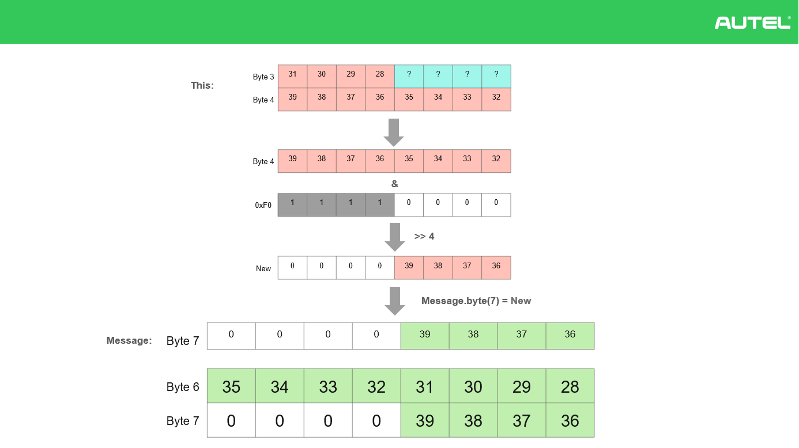

# CAPL
convert CAN message of Benz E200L to J1939 Format
## example for speed signal
<br />
<br />
<br />
<br />
## example CAPL code block for speed signal
```C
/*
convert CAN foramt message (Benz E200L) to CAN extended foramt message (J1939)
*/
includes
{
  
}

variables
{
  message CAN2.*m;
  float BenzFactor;
  float BenzOffset;
  float J1939Factor;
  float J1939Offset;
  /*VehSpeed variables*/
  float VehSpeedPhys_B;
  int VehSpeedRaw_B;
  int VehSpeedRaw_J;
  /*SteerWheelAngle Variables*/

}

void attribut_msg(message*m,int chn, int dlc, dword ID)
{
  m.can = chn; // assign channel 
  m.dlc = dlc; // assign dlc
  m.id = mkExtId(ID); // assign message ID
}
/************************************************************** 
convert VehSpeed singal of Benz to J1939 TachographVehicleSpeed
***************************************************************/
on message VehSpd_X_AR2
{
  J1939Factor = 0.0039062485409696;
  BenzFactor = 0.1;
  BenzOffset = 0.0;
  J1939Offset = 0.0;
  VehSpeedRaw_B = this.VehSpd_X; // get the row value of Benz
  //Write("VehspeedRaw: %d", VehSpeedRaw_B);
  VehSpeedPhys_B = BenzFactor*VehSpeedRaw_B + BenzOffset; // calculate the Benz phys value hier km/h
  //Write("VehspeedPhys: %f", VehSpeedPhys_B);
  VehSpeedRaw_J = (VehSpeedPhys_B-J1939Offset)/J1939Factor; // calculate row value of J1939
  //Write("VehspeedRaw J1939: %X", VehSpeedRaw_J);
  attribut_msg(m,2,this.dlc, 0xCFE6C17);
  m.byte(6) = 0x00FF & VehSpeedRaw_J;
  m.byte(7) = (0xFF00 & VehSpeedRaw_J) >> 8;
  output(m);
}
/*****************************End*****************************/

```
